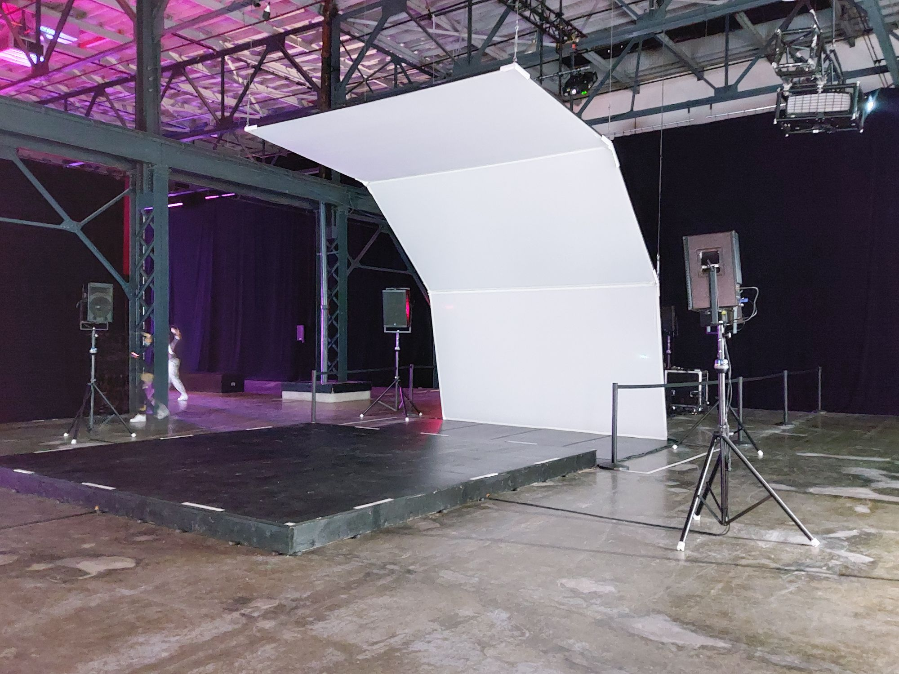
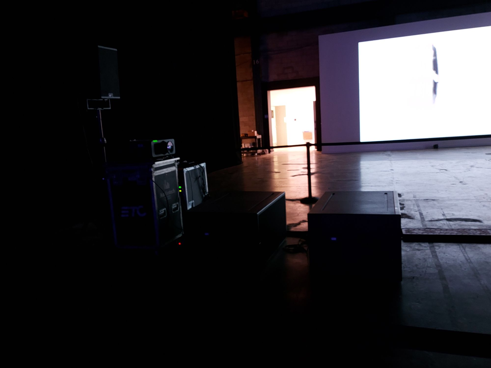
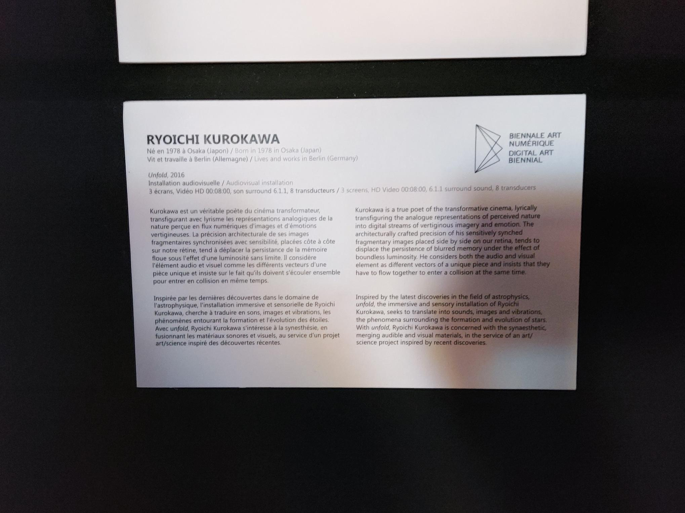
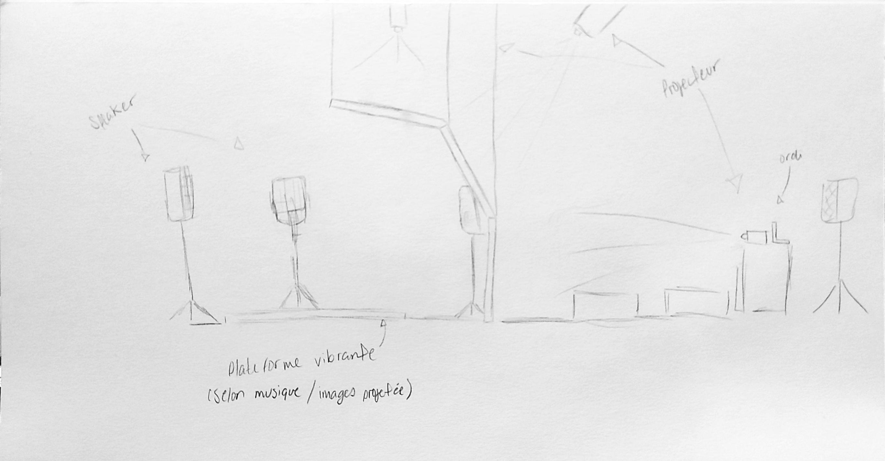

# Présentation de l'oeuvre

### Nom de l'artiste / de la firme
Ryoichi Kurokawa

### Année de réalisation
2016

### Nom de l'exposition / de l'événement
METAMORPHOSIS - Biennale d’art numérique (BIAN)

### Lieu de mise en exposition
Arsenal art contemporain

### Date de la visite
10 Février 2022

### Description de l'oeuvre / dispositif multimédia
Inspirée par les dernières découvertes dans le domaine de l'astrophysique, l'installation immersive et sensorielle de Ryoichi Kurokawa, cherche à traduire en sons, images et vibrations, les phénomènes entourant la formation et l'évolution des étoiles. Avec *unfold*, Ryoichi Kurokawa s'intéresse à la synesthésie, en fusionnant les matériaux sonores et visuels, au service d'un projet art/science inspiré des découvertes récentes. 

### Explication sur la mise en espace de l'oeuvre / du dispositif
Dès l'entrée de la salle, il est possible de voir trois grands écrans blancs en angle avec des images projeter dessus, ainsi qu'une plateforme en face de ces écrans. Après nous remarquons les choses plus secondaires telles que les speakers et la plateforme. Ensuite si on essaye de faire le tour de l'installation et d'observer tous son alentour il est possible de voir les fils scotcher sur le plancher, les cordes qui tiennent les écrans au plafond, les projecteurs aussi installés au plafond et plusieurs boîtes et l'ordinateur qui s'occupe des images projeter, brancher à l'arrière de l'installation.

### Liste des composantes et techniques de l'oeuvre / du dispositif 
Installation audiovisuelle; projection HD, 6.1ch système de son surround, transducteur tactile, loop de 8 min

###  Liste des éléments nécessaires pour la mise en exposition
cordes de soutient pour les écrans, bois pour la plateforme, tape electrique pour cacher les fils électriques

# Expérience vécue

### Description de votre expérience 
Pour commencer, j'ai vraiment aimer le visuel et le sonore, l'oeuvre a vraiment été immersive et intéressante. Aussi le fait que la projection était faite sur plusieurs angle, ma donner envie de rester coucher et de juste regarder ce qui se passait sur la projection. Par contre, malheureusement pour moi, j'ai un certain mal des transport (motion sickness en anglais qui fait plus de sens) donc regarder la projection tout en sentant la vibration en dessous de moi ma donner un peu mal au coeur apres même pas 5 minutes. 

### Ce qui vous a plu, vous a donné des idées, justifiez
J'ai adorer la projection, l'utilisation des couleurs dans l'oeuvre, j'aimerais vraiment faire des oeuvres qui sont aussi 

### Aspect du projet a ne pas retenir pour propre réalisation, justifiez
Le son de l'oeuvre était beaucoup trop fort, malgré qu'ils l'aient baissé lors de notre visite, de plus la musique et/ou sons des autre installation venait empieter sur cette oeuvre, donc pour changer ce fait, je pense qu'il aurait été intéressant d'utiliser des écouteurs, de mettre l'oeuvre dans une salle insonorisée ou de rajouter des mur, sans vraiment l'entourer pour en faire une salle

### Références
--

# Photographies et croquis a intégrer :

### Photographies de l'oeuvre / dispositif dans son ensemble

### Photographies des composantes de l'oeuvre

### Photographies des éléments nécessaires à sa mise en place

### Photographie du cartel / panneau explicatif

### Autoportrait de vous avec l'oeuvre
Je n'ai pas d'autoportrait avec l'oeuvre choisi, mais j'ai un autoportrait avec une autre : 

### Croquis de la mise en espace 

### Court vidéos pour documenter les actions / l'intéractivité de l'oeuvre
--

