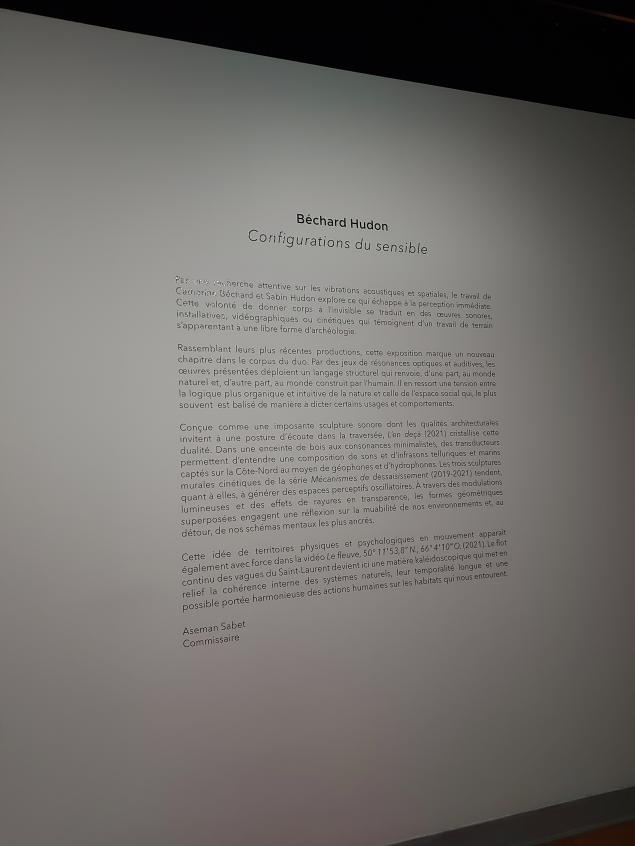
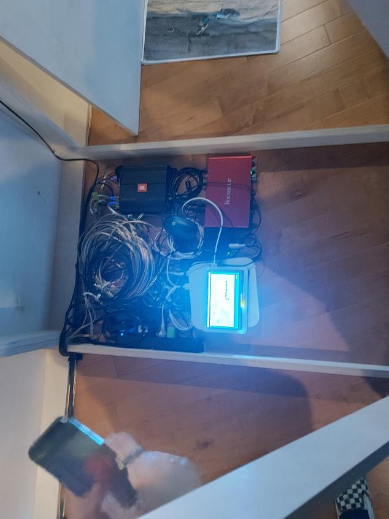
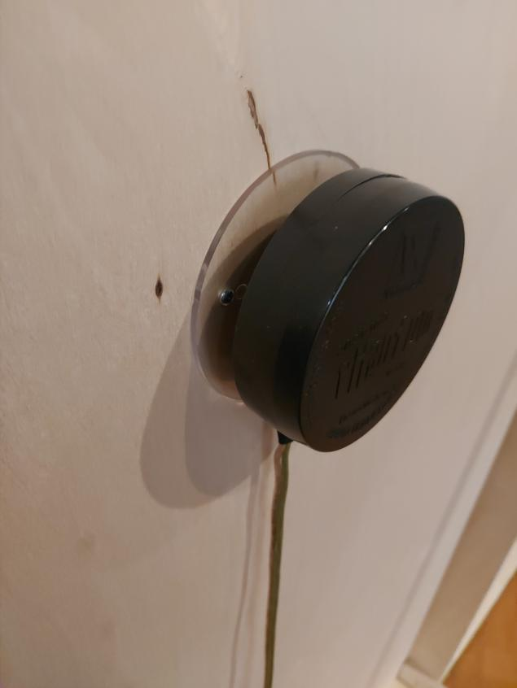
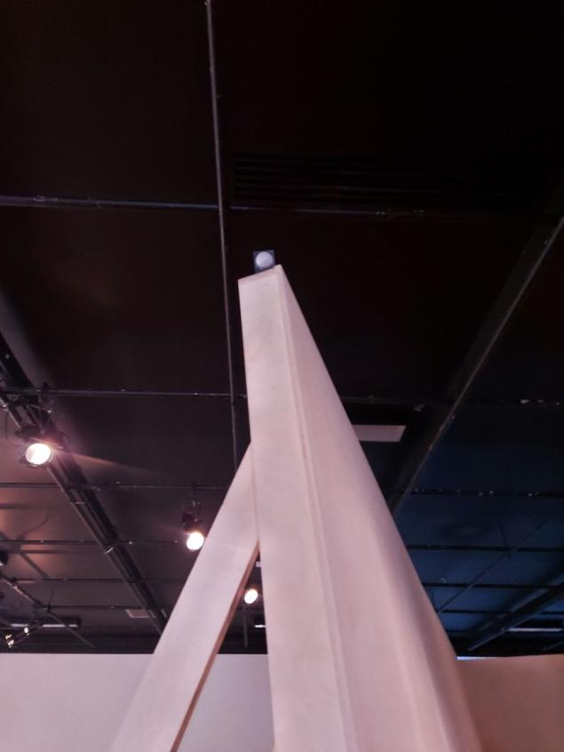
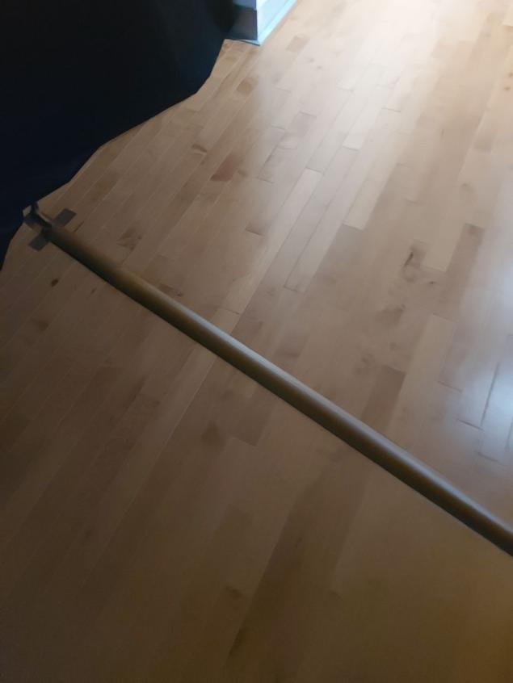
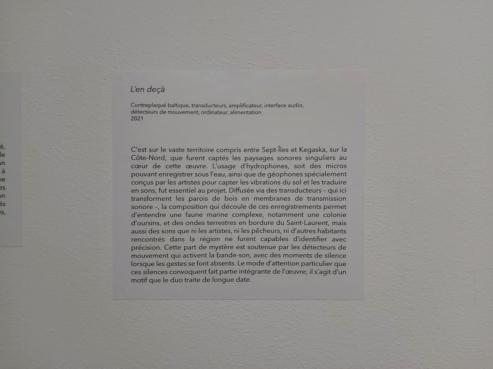
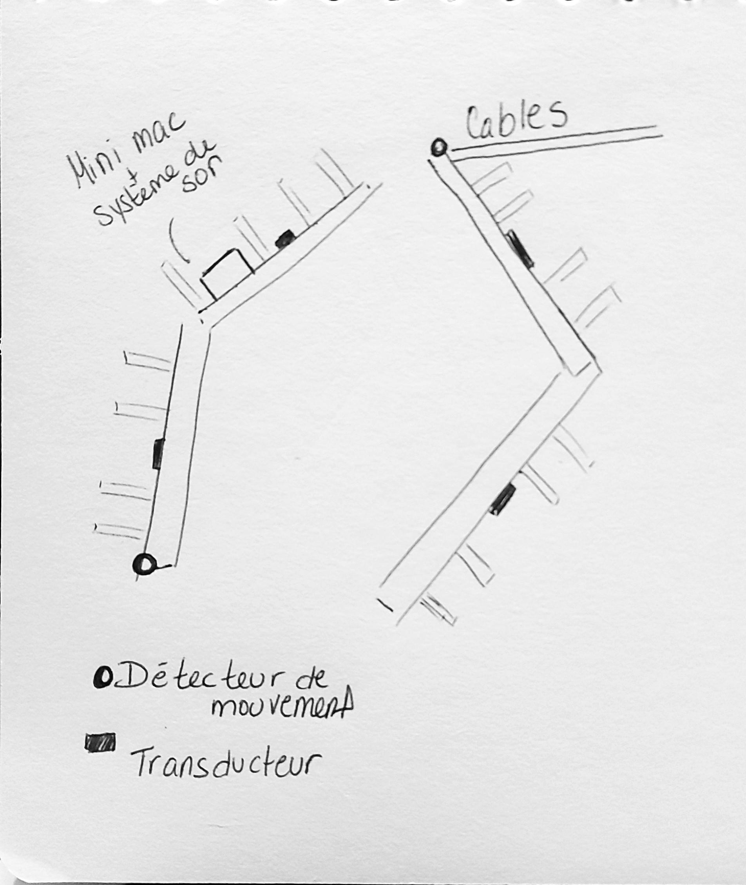

## Titre de l'oeuvre
L'en deçà

#### Photographies de l'oeuvre / dispositif dans son ensemble :

## Nom de l'artiste / de la firme
Béchard Hudon

## Année de réalisation
2021

## Nom de l'exposition / de l'événement
Configurations du sensible

## Lieu de mise en exposition
Maison des arts de Laval

## Date de la visite
17 mars 2022

## Description de l'oeuvre / dispositif multimédia
Cette oeuvre, qui est en contreplaqué, veut inviter le public à le toucher et à écouter les sons que ce dernier déploie, par son matériel. Les transducteurs, qui sont vissés au bois de l'oeuvre, transmettent les sons dans le bois et le rend auditif pour son spectateur.trice

## Explication sur la mise en espace de l'oeuvre / du dispositif
L'oeuvre est située au plein centre de la salle, et la musique vient de ce dernier. Le système de son est caché en dessous d'une plaque de bois soigneusement couper et mesurer afin de le rendre "invisible" au public. De plus, un ruban de la même couleur et texture que le plancher vient méticuleusement caché les câbles de l'oeuvre qui se rend jusqu'à la source d'alimentation

## Liste des composantes et techniques de l'oeuvre / du dispositif 
contreplaqué baltique, amplificateur, alimentation

#### Photographies des composantes de l'oeuvre

interface audio, ordinateur

transducteurs

détecteurs de mouvement

##  Liste des éléments nécessaires pour la mise en exposition
Tape qui ressemble au sol, afin de recouvrir parfaitement les cables sans s'en rendre compte

# Expérience vécue : 

## Description de votre expérience 
C'était vraiment relaxant, j'ai vraiment aimé l'ambiance que l'endroit émanait. Puisque nous étions invités à toucher l'oeuvre, il était possible de ressentir les vibrations et c'était vraiment apaisant de juste s'appuyer ou s'assoir tout en touchant l'oeuvre. De plus la musique n'était pas trop forte et donc c'était plus invitant de rester dans l'oeuvre et à l'apprécier.

## Ce qui vous a plu, vous a donné des idées, justifiez
j'ai vraiment aimez-le fait que l'oeuvre est très minimaliste, j'ai aimé juste m'accoter ou m'assoir tout en touchant l'oeuvre sans vraiment penser, juste ressentir les vibrations et vivre le moment.

## Aspect du projet à ne pas retenir pour propre réalisation, justifiez
Personnellement, je trouve que l'oeuvre est beaucoup trop simple et pas mon style, si j'étais pour refaire cette oeuvre, je chercherais à faire un espace plus intéressant, plus confortable et j'essayerais de trouver un moyen de le rendre plus interactif ou d'ajouter un certain visuel, comme une intelligence artificielle qui traiterait le son et convertirais ce dernier en couleur, bref trouver un moyen d'ajouter un visuel, rempli un peu plus les sensés que l'oeuvre originale.

# Photographies et croquis à intégrer :

## Photographie du cartel / panneau explicatif

## Croquis de la mise en espace 

## Court vidéos pour documenter les actions / l'intéractivité de l'oeuvre
--
